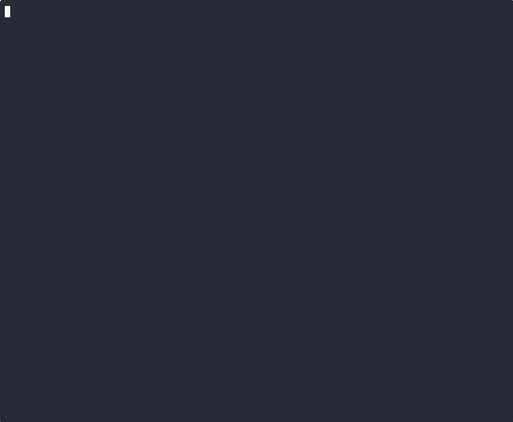

# nxtg-atlas

[](https://pypi.org/project/nxtg-atlas/)
[](https://pypi.org/project/nxtg-atlas/)
[](LICENSE)
[](https://github.com/nxtg-ai/repoatlas/actions)

**Portfolio intelligence for AI engineering teams.**

Scan your repos. Score health. Find cross-project patterns nobody else sees.

<p align="center">
  
</p>

```
pip install nxtg-atlas
```

---

## The Problem

You manage 5, 10, 20+ repos. Every tool on the market — Cursor, Copilot, Claude Code — works inside a single repo. Nobody sees the full picture:

- Which repos have zero tests?
- Are your React versions consistent across projects?
- Where are you duplicating FastAPI patterns instead of sharing them?
- Which repos haven't been touched in weeks?

You don't know until something breaks.

## The Solution

```bash
atlas init --name "My Portfolio"
atlas add ~/projects/api
atlas add ~/projects/frontend
atlas add ~/projects/ml-pipeline
atlas scan
atlas status
```

30 seconds. Full portfolio health dashboard. Real data from your repos.

## What You Get

```
╭───────────────────────  ATLAS Portfolio Dashboard  ─────────────────────────╮
│                                                                             │
│  Portfolio: NXTG.AI  |  8 Projects  |  609 Test Files  |  1,251,303 LOC    │
│  Health: B (82%)  |  Scanned: 2026-03-04T01:15                             │
│                                                                             │
╰─────────────────────────────────────────────────────────────────────────────╯
┌────┬────────────────────┬──────────┬────────┬──────────┬─────────────────────┐
│    │ Project            │ Health   │  Tests │      LOC │ Tech Stack          │
├────┼────────────────────┼──────────┼────────┼──────────┼─────────────────────┤
│ ●  │ Dx3                │  A 94%   │    179 │  164,806 │ Python · TypeScript │
│ ●  │ content-engine     │  B+ 88%  │     23 │   12,552 │ Python              │
│ ●  │ Podcast-Pipeline   │  B+ 88%  │     49 │   33,680 │ Python · FastAPI    │
│ ●  │ nxtg.ai            │  B+ 87%  │     36 │   49,938 │ TypeScript · Next.js│
│ ●  │ Faultline          │  B+ 86%  │     29 │   15,527 │ TypeScript · React  │
│ ●  │ voice-jib-jab      │  B+ 86%  │     58 │   45,311 │ TypeScript · Python │
│ ●  │ SynApps            │  C 67%   │    114 │  793,406 │ Python · TypeScript │
│ ●  │ NXTG-Forge         │  D 59%   │    121 │  136,083 │ TypeScript · Rust   │
└────┴────────────────────┴──────────┴────────┴──────────┴─────────────────────┘
```

*This is real output from scanning 8 production repos. Not a mockup.*

## Features

- **Health scoring** — 4 dimensions (tests, git hygiene, documentation, structure) → A-F grade
- **Tech stack detection** — Python, TypeScript, Rust, Go, Java + frameworks (FastAPI, React, Next.js, Django, etc.)
- **Git health** — branch, commit count, dirty state, remote status
- **Database detection** — PostgreSQL, SQLite, Redis, MongoDB, pgvector
- **Cross-project intelligence** — shared deps, version mismatches, health gaps
- **Batch add** — `atlas batch-add ~/projects` adds every repo at once
- **Export** — markdown and JSON reports for stakeholders
- **Unlimited projects** — no limits, no tiers, no gates

Everything is free. Everything is open source. No catches.

## What It Detects

| Category | Examples |
|----------|---------|
| **Languages** | Python, TypeScript, JavaScript, Rust, Go, Java, Ruby, C++, Swift, Kotlin |
| **Frameworks** | FastAPI, Django, Flask, React, Next.js, Vue, Express, Tailwind, Vite |
| **Test Frameworks** | pytest, Vitest, Jest, Playwright |
| **Databases** | PostgreSQL, SQLite, Redis, MongoDB, pgvector |
| **CI/CD** | GitHub Actions, GitLab CI, Jenkins, CircleCI |
| **Infrastructure** | Docker, Kubernetes, Helm, Terraform, Pulumi, AWS CDK |
| **Cloud** | AWS, GCP, Azure |
| **Serverless** | Vercel, Netlify, Cloudflare Workers, Fly.io, Render |
| **Security** | Dependabot, Renovate, Snyk, CodeQL, Bandit, Gitleaks, Trivy, SECURITY.md |
| **AI/ML** | Anthropic SDK, OpenAI, LangChain, LlamaIndex, Transformers, PyTorch, TensorFlow, scikit-learn, Vercel AI SDK, MLflow, W&B, DVC, ChromaDB, Pinecone, Jupyter |
| **Code Quality** | Ruff, Flake8, Pylint, ESLint, Biome, Black, Prettier, isort, mypy, Pyright, TypeScript, golangci-lint, Clippy |
| **Documentation** | README, CLAUDE.md, CHANGELOG, docs/ |

## Health Score Breakdown

Each project scores 0-100% across 4 dimensions:

```
  Health Breakdown:
    Tests          █████████████░░  90%
    Git Hygiene    ██████████████░  99%
    Documentation  ███████████████  100%
    Structure      █████████████░░  90%
```

| Dimension | What It Measures |
|-----------|-----------------|
| **Tests** (35%) | Test file count relative to source files |
| **Git Hygiene** (20%) | Commits, remote, clean working tree |
| **Documentation** (20%) | README, CLAUDE.md, NEXUS, CHANGELOG, docs/ |
| **Structure** (25%) | CI/CD, .gitignore, package config, source organization, linting |

## Cross-Project Intelligence

Atlas finds patterns across your repos that no single-repo tool can see:

```
╭───────────────── Cross-Project Intelligence ──────────────────╮
│                                                                │
│  Shared Dependencies                                           │
│    ℹ  fastapi used across 4 projects                           │
│    ℹ  react used across 3 projects                             │
│                                                                │
│  Version Mismatches                                            │
│    ⚠  react: ^18.2.0 (app-a), ^19.2.1 (app-b)                 │
│    ⚠  fastapi: >=0.100.0 (api-v1), >=0.115.9 (api-v2)         │
│                                                                │
│  Health Gaps                                                   │
│    ✖  3 projects have zero tests                               │
│    ⚠  1 project has 50+ uncommitted changes                    │
│                                                                │
╰────────────────────────────────────────────────────────────────╯
```

## Commands

| Command | Description |
|---------|-------------|
| `atlas init` | Create a portfolio |
| `atlas add <path>` | Add a project |
| `atlas scan` | Re-scan all projects |
| `atlas status` | Portfolio dashboard |
| `atlas inspect <name>` | Deep-dive on one project |
| `atlas compare <a> <b>` | Side-by-side project comparison |
| `atlas remove <name>` | Remove a project |
| `atlas connections` | Cross-project patterns |
| `atlas doctor` | Diagnose issues and suggest fixes |
| `atlas trends` | Show health trends across scans |
| `atlas ci` | Health gate for CI pipelines (JSON output, exit codes) |
| `atlas batch-add <dir>` | Add all repos in a directory |
| `atlas export` | Markdown/JSON report |
| `atlas config` | View or update configuration |
| `atlas support` | How to support this project |
| `atlas reset` | Delete all data |

## Requirements

- Python 3.11+
- git (for repo detection)

## How It Works

Atlas scans your project directories — no network calls, no cloud, no telemetry. Everything runs locally.

1. **File walking** — counts source and test files, skipping `node_modules`, `.venv`, `target`, etc.
2. **Config parsing** — reads `pyproject.toml`, `package.json`, `Cargo.toml` for deps and frameworks
3. **Git inspection** — runs `git log`, `git status`, `git branch` for repo health
4. **Health scoring** — weighted formula across 4 dimensions → A-F grade
5. **Cross-project analysis** — compares deps, versions, and patterns across all repos

State lives in `~/.atlas/portfolio.json`. Portable, inspectable, no database.

## FAQ

**Is this open source?**
Yes. MIT license. Every feature is free. No tiers, no gates, no "upgrade to unlock."

**Does it phone home?**
No. Zero network calls. No telemetry. No analytics. Your code stays on your machine.

**How fast is it?**
8 projects with 1.25M lines of code scanned in 31 seconds.

**Does it work with monorepos?**
Each `atlas add` path is treated as one project. For monorepos, add the root.

**Can I use it in CI?**
Yes. `atlas ci` outputs JSON and exits non-zero on health violations:

```yaml
# GitHub Actions example
- run: atlas ci --min-health 70 --min-project-health 50
```

## Support This Project

Atlas is free and always will be. If it saves you time, consider supporting development:

[Support Atlas →](https://github.com/sponsors/nxtg-ai)

Supporters get their name in `SUPPORTERS.md`, priority GitHub issues, and early access to new features.

## License

MIT

---

Built by [NXTG.AI](https://nxtg.ai) — the team behind [NXTG-Forge](https://nxtg.ai/forge).
